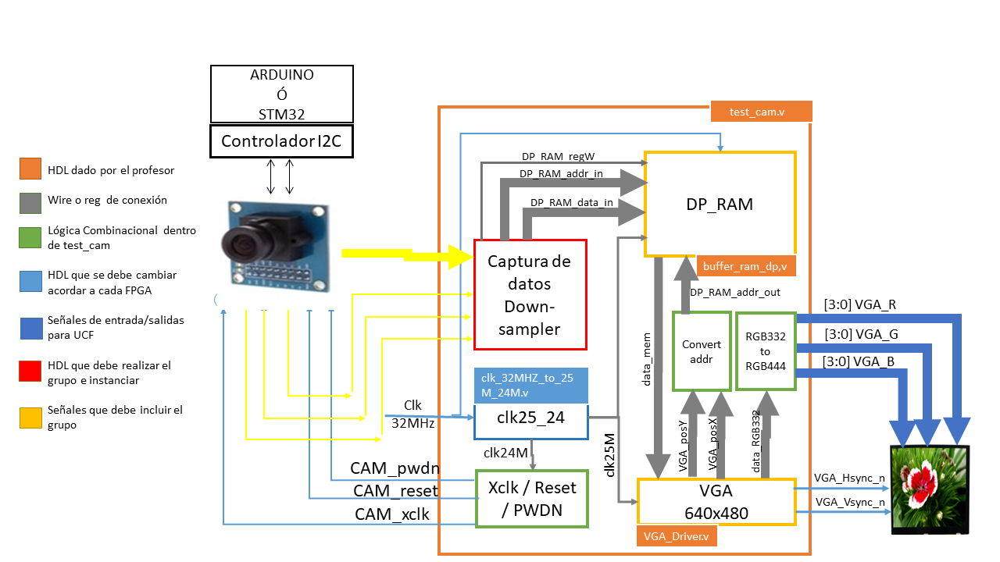

##  ELECTRÓNICA DIGITAL 1 2019 -2 UNIVERSIDAD NACIONAL DE COLOMBIA 
## TRABAJO 02- diseño y prueba del HDL para la camara OV7670

## Introducción 
El sistema de adquisión de la camara  debe adquiror la información de los pixeles y almacenarlos en la el buffer de memoria analizado en el trabajo anterior.
Se propone el siguiente esquema de trabajo, donde el estudiantes puede  testear el  funcionamiento del driver de la camara  diseñado

En este paquete de trabajo los estudiantes deben, en primera instancia, diseñar e implementar la captura datos de la camara según la configuración seleccionada en el WP01 y, adaptar los datos para que se almacene en memoria el pixel con el formato RGB332.

Luego de tener el diseño "captura_datos_downsampler" deben instanciar el  bloque HDL en el test_cam.v.  y probar la funcionalidad  del diseño para ello debe analizar el proyeto propuesto test_cam.xise  junto con el siguiente figura:

Como se observa en la figura anterior, el bloque en rojo y las señales en amarillo indican  que el grupo de trabajo deben adicionarlar al proyecto test_cam.xise para  completar el funcionamiento.

El bloque en azul  es el PLL que realiza el divisor de frecuencias  requeridas 25Mhz y 24Mhz, en el ejemplo este bloque se implementa con una entrada de reloj de 32Mhz  y para la FPGA spartan6. Por tal motivo, es  necesario que cada grupo adpate este bloque a la tarjeta que esta usando. en el desarrolo del  paquete de trabajo se da las indicaciones  para hacer este proceso 

Para este paquete de trabajo, deben   estar inscrito en un grupo y copiar la información del siguiente link  [WP02](https://classroom.github.com/g/fTcztVJQ) .

Debe escribir  la documentación en el archivo README.md de la carpeta docs. Recuerde esta documentación debe ser tal que cualquier compañero de futuros semestres  comprenda sus anotaciones  y las relacione con el HDL diseñado

***Recuerde: Revisar  las instrucciones dadas en metodología y documentación.***

## Material 

Para este paquete de trabajo se debe contar con:

* Pantalla con emtrada VGA  y cuya resolución sea 640x480
* FPGA que cuenta con puerto VGA
* Cable VGA
* Plantilla del projecto  sugerido [WP02](https://classroom.github.com/g/fTcztVJQ) .
* Datasheet de la camara OV7670

## Desarrollo

Como se ha explicado en clase este paquete de trabajo debe desarrollar el siguiente bloque funcional:

Para lo cual, la adquisión de datos debe ser acorde al funcionamiento de  la cámara. para ello debe analizar la siguiente grafica:

una vez diseñe el sistema digital de adquisión de los pixeles, debe realizar el downsampler  y transmitir la información al buffer de memoria. Recuerde la memoria se ha diseñado para almacenar el pixel en formato RGB332, y almacenar 3 bit para el color rojo  y verde  y 2 bit para el color Azul. Si usted, por ejemplo, selecciona el formato RGB565 de la cámara debe convertir los 5 bit de rojo en 3 bit.

 Este bloque se debe modificar según sea le caso. El ejemplo esta dado para
  fpga Spartan6 lx9 a 32MHz.
  usar "tools -> Core Generator ..."  y general el ip con Clocking Wizard
  el bloque genera un reloj de 25Mhz usado para el VGA  y un relo de 24 MHz
  utilizado para la camara , a partir de una frecuencia de 32 Mhz

### Simulación (TestBench):

Una vez resultas las anteriores preguntas se  debe descargar el paquete de trabajo 01 de este link  [WP01](https://classroom.github.com/g/Ra4G34mi).
Una vez aceptado el repositorio debe descargarlo en su computador, para ello debe  clonar el mismo. Si no sabe cómo hacerlo  revise la metodología de trabajo, donde se explica el proceso

Una vez clone el repositorio, realice lo siguiente:

* Comprenda cada línea del código HDL del archivo **buffer_ram_dp.v** que se encuentra en la carpera src. Si cree necesario realice los respectivos comentarios  en el mismo archivo.
* Configure los parámetros del ancho de palabra **DW**  y tamaño de dirección **AW**, según los resultados dados en la pregunta 1 y 2.
* Cree el proyecto HDL  donde el top sea **buffer_ram_dp.v**. Puede usar ise o construir el makefile. 
* Modifique el archivo **image.men**, para que contenga todos los pixeles de un solo color  y que corresponda a la memoria calculada.
* Modifique el archivo **TB_ram**, con el fin de adicionar las estímulos necesarios para simular la lectura y escritura de la memoria ram. Genera la simulación 
* Revise que el sistema funciona como usted lo esperaba. Realice lo comentarios necesarios  en el archivo README.md. 
* Realice la respectiva publicación del repositorio antes de la fecha dada. 

